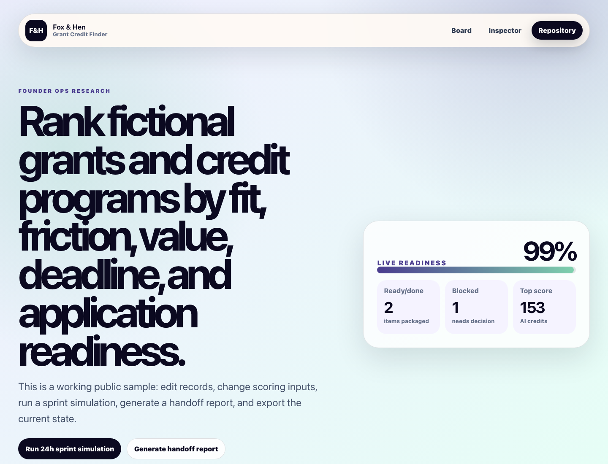

# Grant Credit Finder

Grant and AI-credit finder for tracking eligibility, deadlines, value, friction, and application readiness.



## Live Demo

- Demo: [https://freetoolsforpeople.com/grant-credit-finder](https://freetoolsforpeople.com/grant-credit-finder)
- Repository: [https://github.com/foxandhenllc/foxhen-grant-credit-finder](https://github.com/foxandhenllc/foxhen-grant-credit-finder)

## Purpose

Grant and AI-credit finder for tracking eligibility, deadlines, value, friction, and application readiness.

## Fully Working Behaviors

- Search, filter, and sort the sample work board.
- Add a new sample item and edit owner, notes, priority, value, effort, and friction.
- Advance work status and watch readiness metrics update.
- Run the 24-hour sprint simulation to reprioritize high-value items.
- Toggle QA gates, generate a handoff report, and download the current board as JSON.

## Service Mapping

This repo packages a focused, public-safe workflow around:

- Ranked board
- Editable item inspector
- Readiness checklist
- Exportable handoff report

The app is intentionally static so prospects can inspect the flow, fork it, and replace only the fictional sample records in `src/data.ts`.

## Fork This Demo

1. Replace the fictional work items in `src/data.ts` with your own public-safe sample scenario.
2. Update colors, service copy, repository URL, and live demo URL in the same file.
3. Keep screenshots, exported JSON, and README examples free of credentials, real customer data, and personal contacts.
4. Run `npm run build --silent` before publishing.

See `docs/forking-guide.md` for a checklist and starter client brief.

## SEO / AIO Discoverability

**Plain-language answer:** Use this repo to track grant and AI-credit opportunities by eligibility, deadline, value, friction, and readiness.

**Who it helps:** founders, AI builders, and operators tracking credits, perks, and grant opportunities.

**Search intents covered:**

- AI credits tracker
- startup grant finder dashboard
- founder perk tracker
- grant eligibility checklist

**Why this repo is useful:** It helps teams prioritize non-dilutive opportunities without losing deadlines or chasing poor-fit applications.

## Local Run

```bash
npm install
npm run dev
npm run build
```

## Public-Safe Scope

This is a static React/Vite demo with fictional sample data. It includes no production data, credentials, real contacts, copied customer work, backend, auth, or external service calls.
